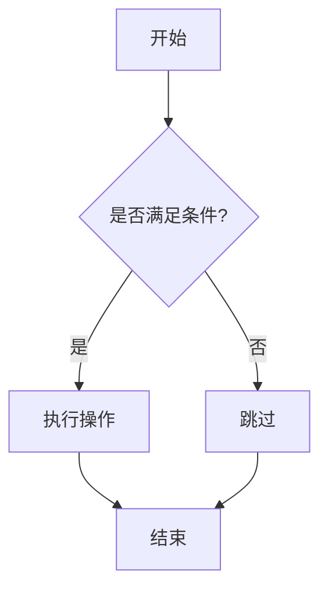
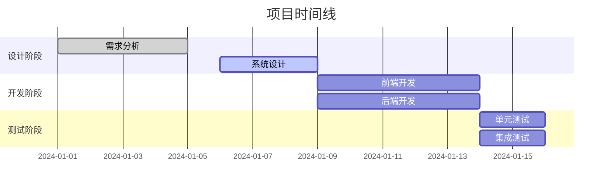
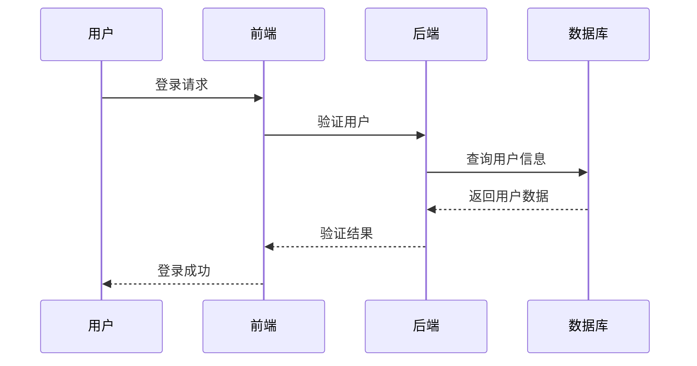
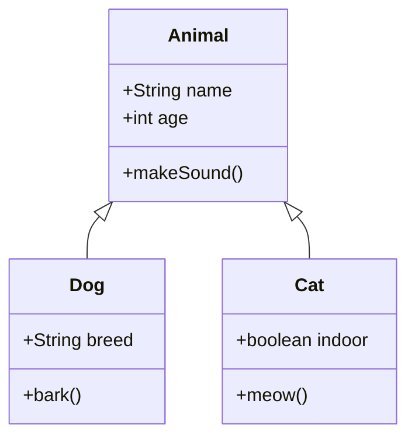
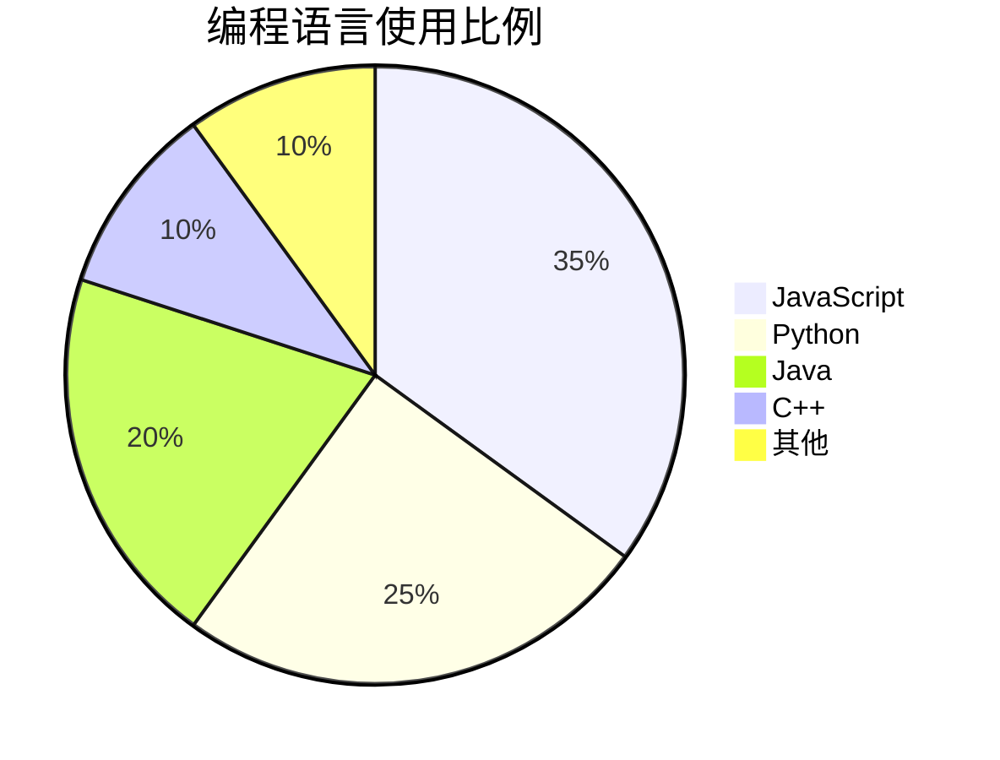
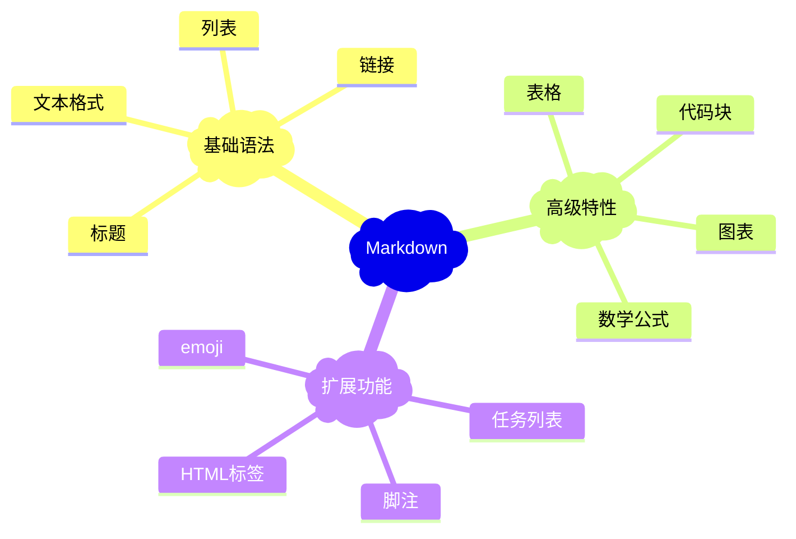

# Markdown 语法演示

这是一个全面的 Markdown 语法演示文件，展示了 Markdown 的所有主要语法特性。

## 1. 标题 (Headers)

# 一级标题 (H1)

## 二级标题 (H2)

### 三级标题 (H3)

#### 四级标题 (H4)

##### 五级标题 (H5)

###### 六级标题 (H6)

## 2. 文本格式 (Text Formatting)

**粗体文本** 或 __粗体文本__

*斜体文本* 或 _斜体文本_

***粗斜体文本*** 或 ___粗斜体文本___

~~删除线文本~~

`行内代码`

## 3. 段落和换行 (Paragraphs and Line Breaks)

这是第一个段落。

这是第二个段落。段落之间用空行分隔。

这是一行文本，
这是下一行（使用两个空格换行）。

## 4. 列表 (Lists)

### 无序列表 (Unordered Lists)

- 项目 1
- 项目 2
  - 子项目 2.1
  - 子项目 2.2
    - 子子项目 2.2.1
- 项目 3

* 使用星号

+ 使用加号

### 有序列表 (Ordered Lists)

1. 第一项
2. 第二项
   1. 子项目 2.1
   2. 子项目 2.2
3. 第三项

## 5. 链接 (Links)

[内联链接](https://www.example.com)

[带标题的链接](https://www.example.com "这是链接标题")

[引用式链接][1]

[相对路径链接](./other-file.md)

自动链接：[https://www.example.com](https://www.example.com)

邮箱链接：<email@example.com>

## 6. 图片 (Images)


![引用式图片][image1]

## 7. 代码 (Code)

### 行内代码

使用 `console.log()` 输出信息。

### 代码块

```
普通代码块
function hello() {
    console.log("Hello, World!");
}
```

### 语法高亮代码块

```javascript
function greet(name) {
    console.log(`Hello, ${name}!`);
}

greet("Markdown");
```

```python
def fibonacci(n):
    if n <= 1:
        return n
    return fibonacci(n-1) + fibonacci(n-2)

print(fibonacci(10))
```

```css
.container {
    max-width: 1200px;
    margin: 0 auto;
    padding: 20px;
}

.header {
    background-color: #f8f9fa;
    border-bottom: 1px solid #dee2e6;
}
```

## 8. 表格 (Tables)

| 姓名 | 年龄 | 城市 |
| ---- | ---- | ---- |
| 张三 | 25   | 北京 |
| 李四 | 30   | 上海 |
| 王五 | 28   | 广州 |

### 对齐表格

| 左对齐 | 居中对齐 | 右对齐 |
| :----- | :------: | -----: |
| 左     |    中    |     右 |
| 内容1  |  内容2  |  内容3 |

## 9. 引用 (Blockquotes)

> 这是一个引用块。
>
> 可以包含多个段落。

> 嵌套引用：
>
>> 这是嵌套的引用。
>>
>>> 更深层的嵌套。
>>>
>>

## 10. 水平分割线 (Horizontal Rules)

---

---

---

## 11. 转义字符 (Escape Characters)

\*这不是斜体\*

\[这不是链接\]

\# 这不是标题

## 12. HTML 标签 (HTML Tags)

`<strong>`HTML 粗体 `</strong>`

`<em>`HTML 斜体 `</em>`

`<u>`下划线文本 `</u>`

`<mark>`高亮文本 `</mark>`

`<sub>`下标 `</sub>` 和 `<sup>`上标 `</sup>`

`<kbd>`Ctrl `</kbd>` + `<kbd>`C `</kbd>`

## 13. 任务列表 (Task Lists)

- [X] 已完成的任务
- [ ] 未完成的任务
- [X] 另一个已完成的任务
  - [ ] 子任务 1
  - [X] 子任务 2

## 14. 脚注 (Footnotes)

这是一个带脚注的文本[^1]。

这是另一个脚注[^bignote]。

## 15. 定义列表 (Definition Lists)

术语 1
:   定义 1

术语 2
:   定义 2a
:   定义 2b

## 16. 缩写 (Abbreviations)

*[HTML]: HyperText Markup Language
*[CSS]: Cascading Style Sheets

HTML 和 CSS 是网页开发的基础技术。

## 17. 数学公式 (Math - 如果支持)

内联数学公式：$E = mc^2$

块级数学公式：

$$
\sum_{i=1}^{n} x_i = x_1 + x_2 + \cdots + x_n
$$

## 18. 流程图 (Mermaid - 如果支持)



## 19. Emoji 表情符号

去露营了！ ⛺️ 很快回来。

真好笑！ 😂

常用emoji：

- 😀 😃 😄 😁 😆 😅 😂 🤣
- ❤️ 💙 💚 💛 💜 🖤 🤍 🤎
- 👍 👎 👌 ✌️ 🤞 🤟 🤘 👏
- 🔥 💯 ⭐ ✨ 🎉 🎊 🎈 🎁

## 20. 高亮文本 (Highlighting)

==高亮文本== （需要支持的解析器）

## 21. 键盘按键 (Keyboard Keys)

按 `<kbd>`Ctrl`</kbd>` + `<kbd>`Alt`</kbd>` + `<kbd>`Del`</kbd>` 重启系统

使用 `<kbd>`⌘`</kbd>` + `<kbd>`C`</kbd>` 复制（Mac）

## 22. 上标和下标 (Superscript & Subscript)

水的化学式是 H`<sub>`2`</sub>`O

爱因斯坦的质能方程：E = mc`<sup>`2`</sup>`

## 23. 进度条 (Progress Bars)

进度条示例（需要HTML支持）：

<progress value="70" max="100">70%</progress>

## 24. 徽章/标签 (Badges)

Version
License
Build

## 25. 折叠内容 (Collapsible Content)

<details>
<summary>点击展开详细信息</summary>

这里是折叠的内容。

- 可以包含列表
- **格式化文本**
- `代码`

```javascript
console.log("甚至可以包含代码块");
```

</details>

<details>
<summary>FAQ: 如何使用Markdown？</summary>

Markdown是一种轻量级标记语言，使用简单的语法来格式化文本。

</details>

## 26. 警告框/提示框 (Alerts/Admonitions)

> **注意**
> 这是一个注意事项。

> **警告**
> ⚠️ 这是一个警告信息。

> **提示**
> 💡 这是一个有用的提示。

> **信息**
> ℹ️ 这是一般信息。

## 27. 颜色文本 (Colored Text)

`<span style="color: red">`红色文本

`<span style="color: blue">`蓝色文本

`<span style="color: green">`绿色文本

`<span style="background-color: yellow">`黄色背景

## 28. 居中对齐 (Center Alignment)

<center>
这段文本居中对齐
</center>

<div align="center">

**居中的标题**

这是居中的段落内容。

</div>

## 29. 音频和视频 (Audio & Video)

### 音频

<audio controls>
  <source src="./audio-sample.mp3" type="audio/mpeg">
  您的浏览器不支持音频元素。
</audio>

### 视频

<video width="320" height="240" controls>
  <source src="./video-sample.mp4" type="video/mp4">
  您的浏览器不支持视频标签。
</video>

## 30. 图标 (Icons)

使用Font Awesome图标（需要引入CSS）：

`<i class="fas fa-home"></i>` 首页
`<i class="fas fa-user"></i>` 用户
`<i class="fas fa-cog"></i>` 设置
`<i class="fas fa-heart" style="color: red;"></i>` 喜欢

## 31. 多媒体嵌入 (Embedded Media)

### YouTube视频嵌入

[YouTube视频](https://www.youtube.com/watch?v=dQw4w9WgXcQ)

### 嵌入iframe

<iframe width="560" height="315" src="https://www.youtube.com/embed/dQw4w9WgXcQ" frameborder="0" allowfullscreen></iframe>

## 32. 代码差异 (Code Diff)

```diff
  function hello() {
-   console.log("Hello World");
+   console.log("Hello, Markdown!");
  }
```

## 33. 甘特图 (Gantt Chart - Mermaid)



## 34. 时序图 (Sequence Diagram - Mermaid)



## 35. 类图 (Class Diagram - Mermaid)



## 36. 饼图 (Pie Chart - Mermaid)



## 37. 思维导图 (Mind Map - Mermaid)



## 结语

这个文件展示了 Markdown 的主要语法特性。不同的 Markdown 解析器可能对某些高级特性（如脚注、数学公式、流程图等）的支持程度不同。

---

*最后更新：2024年*

**注意**：某些高级特性（如脚注、数学公式、Mermaid图表）可能需要特定的Markdown解析器支持。

[1]: https://www.example.com
[image1]: https://via.placeholder.com/150x100
[^1]: 这是第一个脚注的内容。
    
[^note]: 这是命名脚注的内容，可以包含多行。
    
       甚至可以包含代码块和其他格式。
