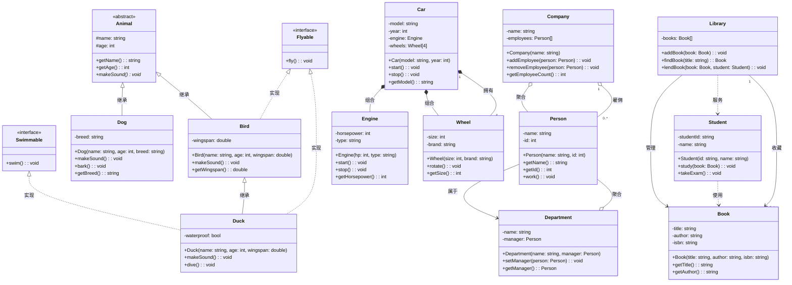

# UML类图关系示例

本文档展示了UML中的各种关系类型，包括继承、实现、组合、聚合、关联和依赖关系。

## Mermaid类图代码

## 关系类型说明

### 1. 继承 (Inheritance) - `<|--`
- **含义**: "is-a" 关系，子类继承父类的属性和方法
- **箭头**: 实线三角箭头，指向父类
- **示例**: Dog继承Animal，Bird继承Animal

### 2. 实现 (Realization) - `<|..`
- **含义**: 类实现接口的关系
- **箭头**: 虚线三角箭头，指向接口
- **示例**: Bird实现Flyable接口，Duck实现Flyable和Swimmable接口

### 3. 组合 (Composition) - `*--`
- **含义**: "part-of" 关系，强拥有关系，整体销毁时部分也销毁
- **箭头**: 实心菱形箭头，菱形指向整体
- **示例**: Car拥有Engine，Car销毁时Engine也销毁

### 4. 聚合 (Aggregation) - `o--`
- **含义**: "has-a" 关系，弱拥有关系，整体销毁时部分可以独立存在
- **箭头**: 空心菱形箭头，菱形指向整体
- **示例**: Company拥有Employee，Company解散时Employee可以存在

### 5. 关联 (Association) - `-->`
- **含义**: 类之间的结构化关系，通常表示一个类知道另一个类
- **箭头**: 实线箭头，指向被关联的类
- **示例**: Person关联Department，Library关联Book

### 6. 依赖 (Dependency) - `..>`
- **含义**: 一个类使用另一个类，通常是临时性的
- **箭头**: 虚线箭头，指向被依赖的类
- **示例**: Student使用Book学习，Library为Student提供服务